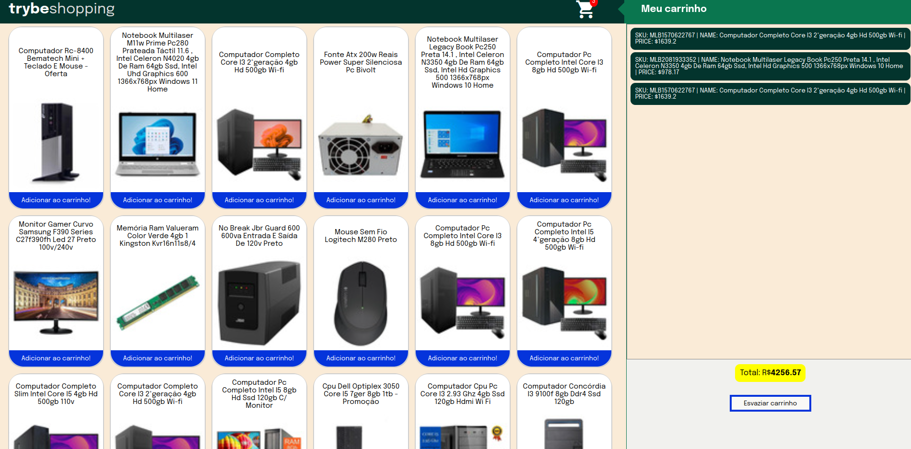

# Carrinho de Compras

#### Javascript | HTML | DOM | CSS | API | LocalStorage | Jest

 

## Objetivos:

O projeto consiste em consumir uma API de produtos do Mercado Livre, e exibí-los na tela como em um ecommerce, e permitindo que fosse possível adicionar e remover itens do carrinho, e utilizando o localStorage do navegador. Além disso, consiste também em praticar os conhecimentos adiquiridos sobre testes automatizados e o conceito de TDD (Test Driven Development).

<section>
- Praticar testes em unitários
  - Praticar aprendizados em operações assíncronas
  - Praticar aprendizados sobre consumo de APIs
  - Praticar aprendizados em DOM
  - Praticar aprendizados em CSS
  - Praticar Aprendizados sobre LocalStorage

</section>

 

## Requisitos alcançados:

>1 - Desenvolva testes para atingir 25% de cobertura total e 100% da função fetchProducts
  2 - Crie uma listagem de produtos
  3 - Desenvolva testes para atingir 50% de cobertura total e 100% da função fetchItem 
  4 - Adicione o produto ao carrinho de compras
  5 - Remova o item do carrinho de compras ao clicar nele
  6 - Desenvolva testes para atingir 75% de cobertura total e 100% da função saveCartItems
  7 - Desenvolva testes para atingir 100% de cobertura total e 100% da função getSavedCartItems
  8 - Implemente a lógica no botão Esvaziar Carrinho para limpar o carrinho de compras
  9 - Adicione um texto de `carregando` durante uma requisição à API

 

## Créditos:

- Desenvolvido por mim: O conteúdo nescessário para alcançar os requisitos.

- Desenvolvido pela Trybe: Arquivos e scripts de configuração e testes cypress.